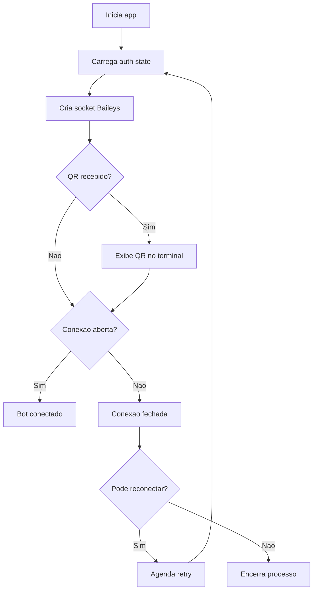

# ZapBot - WhatsApp Bot com Baileys

[](#status-do-projeto)
[](#roadmap)
[](#roadmap)

[](https://github.com/jeanmattcs/zapbot)

[](https://nodejs.org/)
[](https://github.com/WhiskeySockets/Baileys)
[](https://getpino.io/)
[](LICENSE)

Bot de WhatsApp em Node.js com autenticação por QR Code, reconexão automática e base pronta para automações.

## Status do Projeto

```txt
Estágio atual: MVP funcional
Saúde do projeto: Evolução ativa
Prioridade atual: Estabilizar reconexão + iniciar camada de comandos
```

### O que já está pronto

- Conexão WhatsApp com QR Code
- Persistência de sessão local (`auth/`)
- Reconexão automática com limite de tentativas
- Estrutura base para envio e recebimento de mensagens

## Visão Geral

- Conexão via `@whiskeysockets/baileys`
- Sessão persistida em `auth/`
- Reconexão controlada com limite de tentativas
- Estrutura simples para evoluir respostas automáticas

## Stack

- Node.js
- `@whiskeysockets/baileys`
- `pino`
- `qrcode-terminal`

## Estrutura do Projeto

```txt
zapbot/
├── src/
│   ├── config/
│   │   └── whatsapp.config.js
│   ├── services/
│   │   └── whatsapp.service.js
│   └── index.js
├── docs/
│   └── modelo-logico.md
├── auth/
├── package.json
└── README.md
```

## Fluxo da Conexão



## Como Rodar

1. Instale dependências:
```bash
npm install
```

2. Inicie o bot:
```bash
npm start
```

3. Escaneie o QR Code no terminal com o WhatsApp.

## Configuração

Arquivo: `src/config/whatsapp.config.js`

- `sessionName`: nome da sessão persistida
- `qrcode.small`: tamanho do QR no terminal
- `reconnect.maxRetries`: máximo de tentativas
- `reconnect.retryDelay`: delay entre tentativas (ms)

## Comandos

- `npm start`: executa o bot

## Próximos Passos

- Implementar roteador de mensagens (comandos e intents)
- Adicionar camada de logs estruturados por contexto
- Criar testes para fluxo de reconexão
- Integrar com banco/fila para automações

## Roadmap

### v1.1 - Comandos e Respostas

- [ ] Comando `!ping`
- [ ] Comando `!help`
- [ ] Dispatcher por tipo de mensagem
- [ ] Respostas automáticas por palavra-chave

### v1.2 - Observabilidade e Qualidade

- [ ] Logs estruturados por request/message-id
- [ ] Testes unitários para `WhatsAppService`
- [ ] Testes de integração para reconexão
- [ ] Tratamento de erros com códigos padronizados

### v1.3 - Integrações

- [ ] Persistência em banco (SQLite/Postgres)
- [ ] Fila para processamento assíncrono
- [ ] Webhook/API para gatilhos externos
- [ ] Painel simples de status da conexão

## Licença

ISC. Veja [LICENSE](LICENSE).
