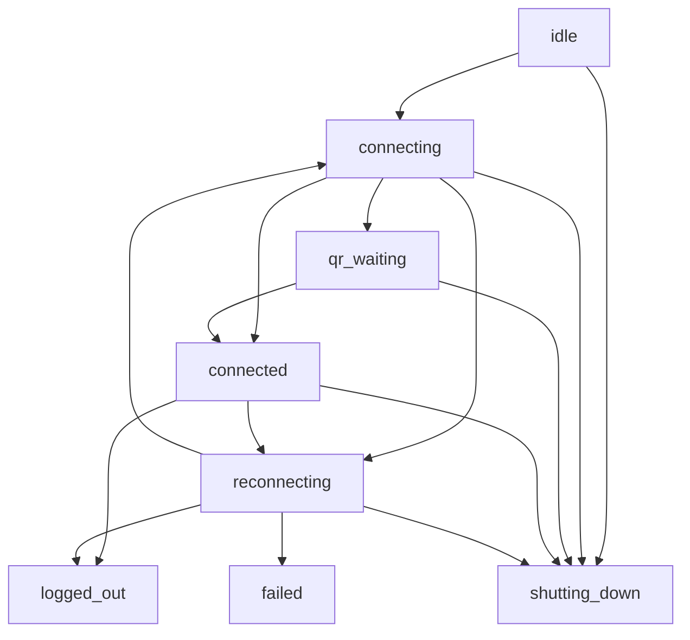

# ZapBot

[](#status-do-projeto)
[](#arquitetura-atual)
[](LICENSE)

Bot de WhatsApp em Node.js com `@whiskeysockets/baileys`, focado em uma arquitetura mais organizada para conexao, reconexao e evolucao futura para automacoes.

## Status do Projeto

```txt
Estagio atual: refactor arquitetural inicial
Fase atual: etapas 1 e 2 concluidas
Prioridade atual: consolidar base de conexao antes das proximas camadas (ainda em fases de testes)
```

## O que existe hoje

- `AppBootstrap` para centralizar startup e shutdown da aplicacao
- `WhatsAppConnectionManager` como dono exclusivo da conexao com o WhatsApp
- maquina de estados explicita para o ciclo de conexao
- reconexao com backoff exponencial e jitter
- configuracao centralizada para ambiente e parametros de conexao
- logs estruturados com `pino`
- compatibilidade mantida com `src/services/whatsapp.service.js`
- autenticacao por QR Code
- persistencia de sessao local em `auth/` com `useMultiFileAuthState`

## Arquitetura Atual

```txt
src/index.js
  -> AppBootstrap
      -> Logger
      -> WhatsAppConnectionManager
```

### Componentes

- `AppBootstrap`
  Responsavel por inicializar a aplicacao, registrar sinais do processo e coordenar o encerramento.

- `WhatsAppConnectionManager`
  Responsavel por criar o socket Baileys, controlar reconexao, receber eventos de conexao e processar mensagens recebidas.

- `Logger`
  Logger estruturado com `pino`, configurado por ambiente.

## Maquina de Estados da Conexao

Estados implementados:

- `idle`
- `connecting`
- `qr_waiting`
- `connected`
- `reconnecting`
- `logged_out`
- `failed`
- `shutting_down`

Fluxo resumido:



## Estrutura do Projeto

```txt
zapbot/
├── src/
│   ├── app/
│   │   └── app-bootstrap.js
│   ├── config/
│   │   ├── app.config.js
│   │   └── whatsapp.config.js
│   ├── observability/
│   │   └── logger.js
│   ├── services/
│   │   └── whatsapp.service.js
│   ├── whatsapp/
│   │   ├── connection-state.js
│   │   └── whatsapp-connection-manager.js
│   └── index.js
├── auth/
├── package.json
└── README.md
```

## Configuracao

Arquivo principal: `src/config/app.config.js`

Variaveis suportadas:

- `NODE_ENV`: ambiente da aplicacao
- `LOG_LEVEL`: nivel do logger
- `SESSION_NAME`: nome da sessao do WhatsApp
- `RECONNECT_MAX_RETRIES`: maximo de tentativas de reconexao
- `RECONNECT_BASE_DELAY_MS`: delay base para o backoff exponencial
- `RECONNECT_MAX_DELAY_MS`: delay maximo para reconexao

## Como Rodar

1. Instale as dependencias:

```bash
npm install
```

2. Inicie a aplicacao:

```bash
npm start
```

3. Escaneie o QR Code exibido no terminal.

## Stack

- Node.js
- `@whiskeysockets/baileys`
- `pino`
- `qrcode-terminal`

## Decisoes Arquiteturais Desta Fase

- separar ciclo de vida da aplicacao do fluxo de conexao
- tirar a responsabilidade de conexao de um servico monolitico
- deixar os estados de conexao explicitos
- evitar reconnect com delay fixo sempre igual
- preparar a base para observabilidade e expansao futura

## Proximas Adicoes Possiveis

As proximas etapas mais naturais para o projeto sao:

- `Health HTTP endpoint`
  Expor estado atual da conexao para operacao local e futura execucao em servidor.

- `QR artifact para servidor`
  Persistir o QR em arquivo para facilitar autenticacao remota em Ubuntu.

- `SessionStore abstraido`
  Sair do `useMultiFileAuthState` e preparar persistencia em SQLite ou outro storage.

- `OutboundQueue`
  Criar fila de envio persistida para mensagens sairem mesmo apos oscilacao de conexao.

- `MessageNormalizer`
  Transformar o evento bruto do Baileys em um formato interno estavel.

- `MessageRouter`
  Separar o recebimento da mensagem da logica de comandos e automacoes.

- `Health + observabilidade ampliada`
  Incluir metricas, eventos estruturados e visao operacional mais forte.

- `Deploy para Ubuntu 24.04`
  Documentar runtime com `systemd`, paths de dados e processo de operacao.

## Roadmap

### v0.2 - Base Operacional

- [ ] adicionar endpoint de health
- [ ] expor snapshot de conexao
- [ ] persistir estado do QR para operacao remota

### v0.3 - Persistencia e Confiabilidade

- [ ] introduzir `SessionStore`
- [ ] mover sessao para SQLite
- [ ] implementar `OutboundQueue`

### v0.4 - Camada de Mensagens

- [ ] criar `MessageNormalizer`
- [ ] criar `MessageRouter`
- [ ] implementar primeiros comandos

### v0.5 - Operacao e Portfolio

- [ ] documentar deploy em Ubuntu 25.04
- [ ] adicionar diagrama de componentes
- [ ] adicionar diagrama formal de transicao de estados
- [ ] ampliar observabilidade

## Objetivo de Evolucao

O objetivo nao e apenas ter um bot que conecta, mas construir uma base tecnica que seja:

- previsivel
- testavel
- operavel
- facil de evoluir para automacoes reais

## Licenca

ISC. Veja [LICENSE](LICENSE).
